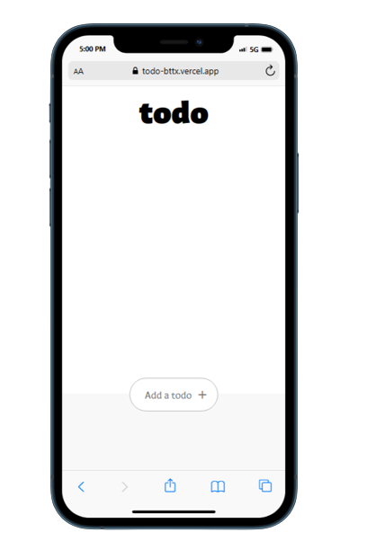
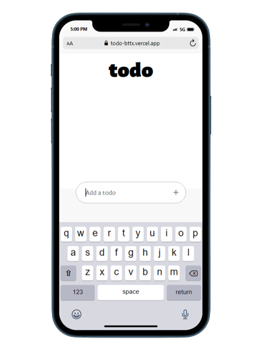
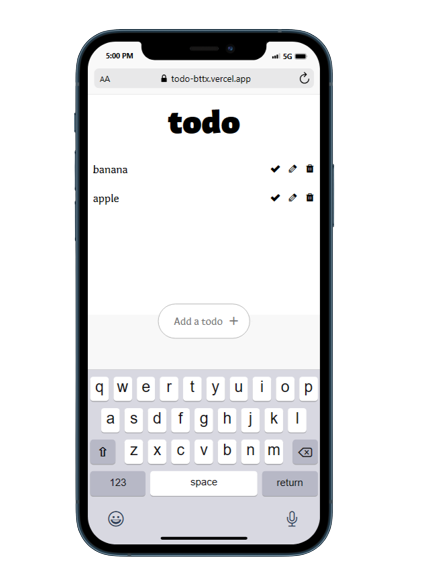

# ToDo Website

Hello everyone, I created a to-do website using **HTML**, **CSS**, and **Vanilla JavaScript**. It was easy to create the UI and the basic functionalities like, **ADD**, **EDIT**, **DELETE**, and **MARK AS COMPLETE**, but the part where I have to store these to-dos in local storage and edit it and delete it makes it a difficult challenge for me. However, with the help of **Chat-GPT** and **Google** I was able to accomplish the challenge.

## Screenshots

## Problems I faced

- Local Storage
- UI Design (This is not my first design for this project)
